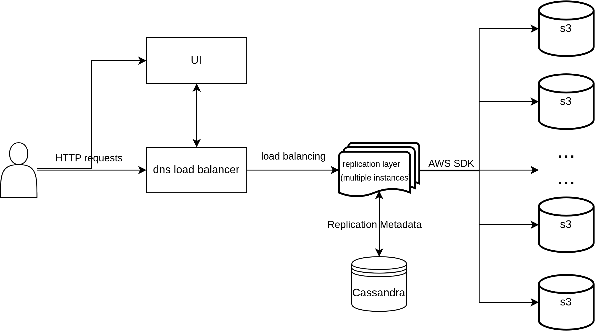
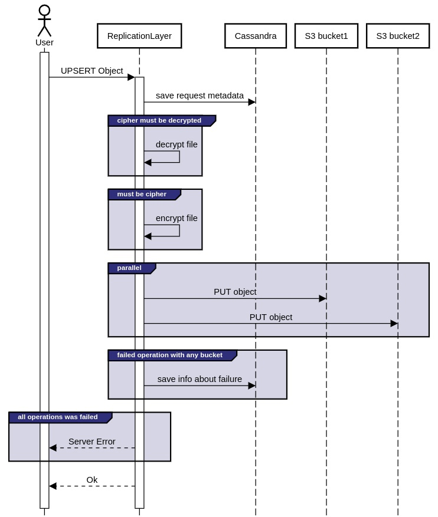
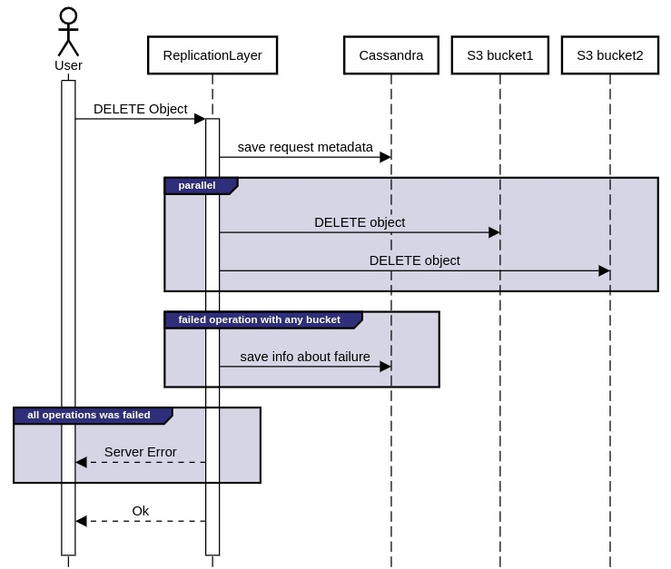
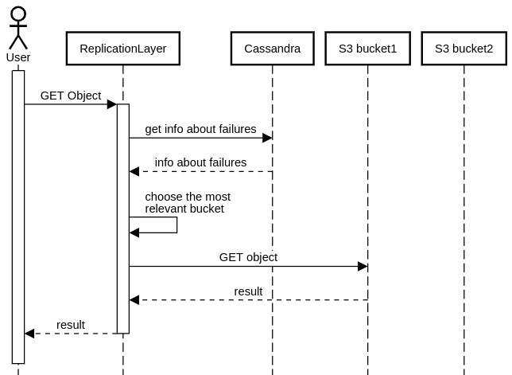
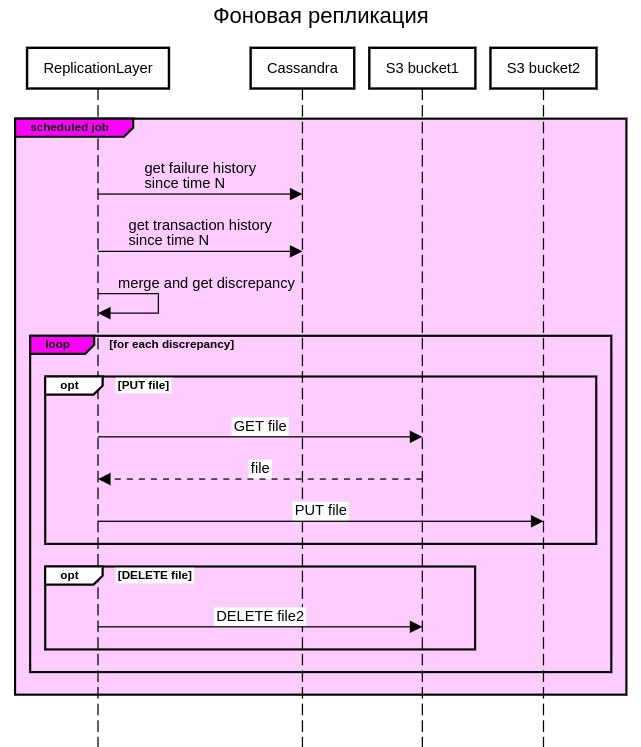
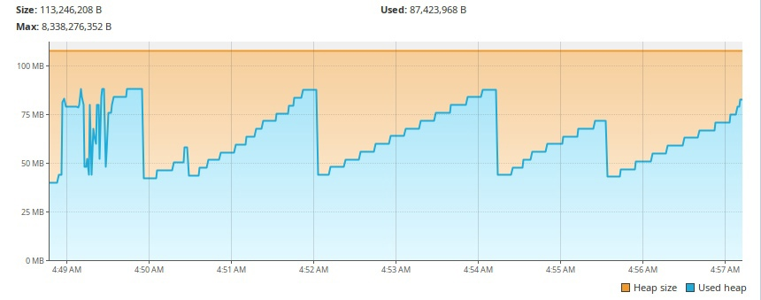
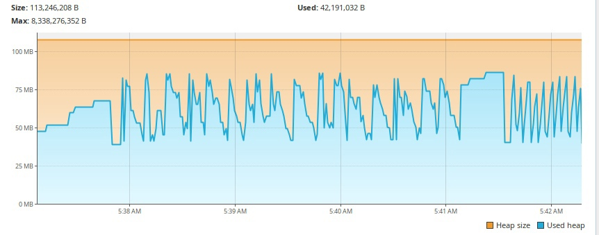

# S3-replication-service
## Third place at [VTB API hackathon 2023](https://vtbapihack.ru/)

- [S3-replication-service](#s3-replication-service)
- [How it works](#how-it-works)
    + [General idea](#general-idea)
    + [UPSERT](#upsert)
    + [DELETE](#delete)
    + [GET](#get)
    + [Replication](#replication)
        - [Background replication](#background-replication)
    + [Authorization](#authorization)
    * [Performance](#performance)
        - [File 100mb](#file-100mb)
        - [File 1000mb](#file-1000mb)
    * [Demo](#demo)

#### The solution is implemented in Kotlin using spring webflux.

Writing files to buckets is carried out in parallel in parts.
If writing to any of the buckets was successful or, on the contrary, failed due to an error, then the corresponding
information is written to the database (Apache Cassandra).
This allows you to replicate data in the background and reload files into failed buckets,
and also allows you to monitor the status of files in the buckets.

# How it works
### General idea
We use an additional database as a log-structured storage for storing various information about the transmitted data.
The data itself is always stored directly in S3 storages

The replication layer is horizontally scalable and can be used from behind a load balancer.

GET requests to buckets are also balanced across all buckets.

The UI is a separate component that accesses the replication layer through the load balancer.

### UPSERT

* We save information about the request - type, file path, time, etc.
* At the same time, we upload files to buckets
* If there is an error in writing to any of the buckets, we save information about the failure
* If it is impossible to write to any bucket, we inform the user about this

### DELETE

* We save information about the request - type, file path, time, etc.
* We execute requests to buckets in parallel
* If a request fails, we store information about the failure in any of the buckets
* If it is impossible to delete from any bucket, we inform the user about this

### GET

* Choose any bucket that is the most relevant
* To do this, we turn to Cassandra and select a bucket that has no errors or is already synchronized
* Execute the request to the bucket

### Replication

* Active mode (works as described in previous topics)
* Disabled (we use only one bucket for writing and reading)
* Background (enabled automatically in active mode)

#### Background replication

* Scheduled job
* Checking the history of file write/delete errors
* Merge errors and request history
* The timestamp determines which files need to be synchronized and in which buckets
* Merge allows you to reduce the number of write/delete operations - for example, file-1 was not written to bucket-2, but then there was a repeat write (or delete) operation of the same file and it was successful for both buckets
* Performing synchronization operations
* For PUT, we get the current file from the current bucket and write it to other buckets
* For DELETE we simply execute the delete request

### Authorization

Authorization via JWT tokens. We store information about the user in Cassandra so as not to create many different databases.

* JWT tokens
* IP limit (you can add several)
* Read/write permission limitation
* File extension limitation
* Restriction by user type (Admin, User)

## Performance

#### File 100mb:

#### File 1000mb:

#### Demo

[demo](assets/gigachad.mp4)

